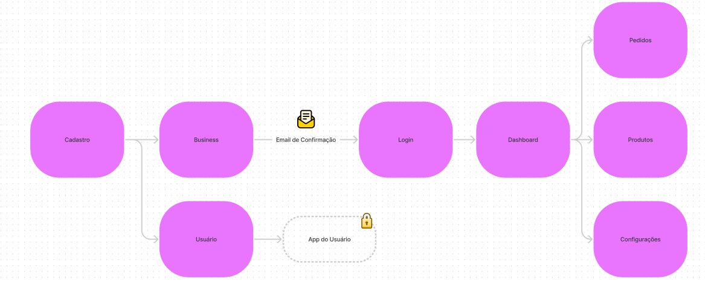

#  🌊  CoastHub FrontEnd

Os grandes players do mercado com o Ifood e Rappi são alvos de críticas por conta das altas taxas de comissão sobre as vendas. Desenvolvemos a **CoastHub** para a gestão de restaurantes delivery de uma maneira prática, simples e acessível. 

## Sobre o Web App
O web app é desenvolvido usando React, com NextJs. Para estilização foi feita usando TailwindCSS. 

A imagem ilustra o fluxo do usuário dentro de nossa plataforma. As tarefas planejasdas seguem nesta lista:

- [ ] APP para Empresas
  - [X] Cadastro
  - [X] Autenticação
  - [ ] Recuperação de Senha
  - [ ] Cadastro de Produtos
  - [ ] Edição de Produtos
  - [X] Gerenciamento de Produtos
  - [ ] Gerenciamento de Pedidos
  - [ ] Atualização de Pedidos
  - [ ] Configuração da Conta

- [ ] APP para Clientes
  - [ ] Cadastro
  - [ ] Autenticação
  - [ ] Recuperação de senha
  - [ ] Solicitação de pedidos
  - [ ] Gerenciamento de Pedidos