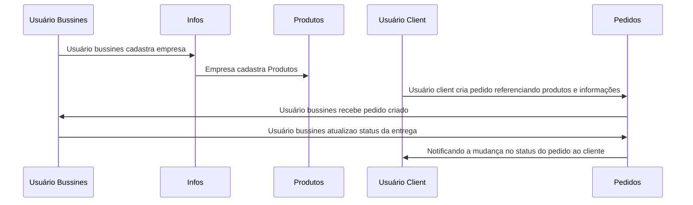

#  🌊 CoastHub

Os grandes players do mercado com o Ifood e Rappi são alvos de críticas por conta das altas taxas de comissão sobre as vendas. Desenvolvemos a **CoastHub** para a gestão de restaurantes delivery de uma maneira prática, simples e acessível. 

 1. Setup
 2. Módulos
 3. Arquitetura
 4. Stack

### Usuários e Configurações
Em nosso sistema existe dois tipos de usuários. O **usuário bussines** pode cadastrar suas empresas e seus produtos, gerenciar e receber os pedidos realizados pelo o usuário cliente. O **usuário cliente** poderá acessar o cardápio do bussines, realizar seus pedidos e efetuar o pagamento via PIX.

| id | email | password | type | timestamp
|--|--|--|--|--|
| 256422d6-42b7-4cbb-8dff-29817972bdbe | leolamerabr@gmail.com | e99a18c428cb38d5f260856| client | 1632261899019 |
| 29a22a04-89f9-4fa0-9403-bc5136aabda9 | pizza24horas@gmail.com | 0d74ce1d868de578ed66cdc| bussines | 1632262002619 |

Os usuários bussines cadastraram suas informações necessárias para a venda, da mesma forma os usuários clientes cadastrarão as informações necessárias para compra e entrega.

```json
// client users
{
	"_id": "fK3ddutEpD2qQqRMXNW5",
	"user_id": "256422d6-42b7-4cbb-8dff-29817972bdbe",
	"firstname": "Leonardo",
	"lastname": "Lopes dos Santos",
	"cpf": "10770106908",
	"adress": [
		{
			"cep": "89218080",
			"logradouro": "RUA IGUAÇU",
			"numero": 489,
			"complemento": "bloco a, apto 504"
			"cidade": "Joinville",
			"uf": "SC"
		}
	]
}

// bussines user
{
	"_id": "Ts1NuNqpGVZsdtUVybNfN",
	"user_id": "29a22a04-89f9-4fa0-9403-bc5136aabda9",
	"bussines_name": "Pizza 24 horas",
	"document": "18558476000108",
    "delivery_time_main_in_minutes": 20,
	"delivery_range_in_km": 20,
    "open_date": {
        "week": {
            "open": 17,
            "close": 00,
        },
        "weekend": {
            "open": 17,
            "close": 23,
        }
    }, 
	"module": "restaurantes",
	"submodule": "pizzaria",
	"adress": [
		{
			"cep": "89230610",
			"logradouro": "RUA MARTIN DEDEKIND",
			"numero": 276,
			"cidade": "Joinville",
			"uf": "SC"
		}
	]
}
```


###  Produtos
Os produtos representam os items a serem vendidos pelos usuários bussines. Esta entidade contém as informações:

| id | product_name | description | price | tag | url_img | user_id | available
|--|--|--|--|--|--|--|--|
| 83533355-e3ab-4e8d-b7d7-0479a370074a | Coca Cola 2L | Garrafa de refrigerente Coca Cola 2L | 9.90 | refrigerante | https://static.clubeextra.com.br/img/uploads/1/15/12034015.jpg | 256422d6-42b7-4cbb-8dff-29817972bdbe | true |

Vinculado aos produtos pelo id, haverá opções, que representaram os detalhes dos pedidos (exemplo: sabores, cores, tamanho, modelo etc)

| id | product_id | option | available
|--|--|--|--|--|--|--|
| cb2fe27a-74ab-4294-845a-05c59e7da2b3 | 4dcc4118-b14f-45a4-b540-02eb72ff2550 | calabresa | true 
| cb2fe27a-74ab-4294-845a-05c59e7da2b3 | 4dcc4118-b14f-45a4-b540-02eb72ff2550 | marguerita | true 


### Pedidos
O pedido é composto por um documento contendo as informações do usuário cliente, usuário bussines, produtos solicitados, local de entrega e informações sobre o pagamento. O status do pedido pode ser classificado em 3 modalidades: aberto quando o usuário bussines ainda não confirmou, em preparo quando já fora confirmado, em entrega quando já saiu para entrega e finalizado após a confirmação do recebimento. 

```json
{
	"_id": "RMXaqsNVypD2qbNfMasWU9",
	"client": "256422d6-42b7-4cbb-8dff-29817972bdbe",
	"bussiness": "29a22a04-89f9-4fa0-9403-bc5136aabda9",
	"products": [
		{
			"product_id": "83533355-e3ab-4e8d-b7d7-0479a370074a",
			"amount": 1,
		},
		{
			"product_id": "4dcc4118-b14f-45a4-b540-02eb72ff2550",
			"amount": 3,
			"options": {
				1: "calabresa",
				2: "calabresa",
				3: "1/2 marguerita, 1/2 chocolate"
			}
		},
	],
	"delivery": {
		"fees": 0.0,
		"time_in_minutes": 30,
		"cep": "89218080",
		"logradouro": "RUA IGUAÇU",
		"numero": 489,
		"complemento": "bloco a, apto 504"
		"cidade": "Joinville",
		"uf": "SC"
	},
	"payment": {
		"paid": true,
		"type": "pix",
		"obs": null
	},
	"timestamp": 1632282526220
}
```

## Diagramas

Diagrama representando a comunicação entre todas os módulos descritos anteriormente.


```mermaid
sequenceDiagram
Usuário Bussines ->> Infos: Usuário bussines cadastra empresa
Infos ->> Produtos: Empresa cadastra Produtos
Usuário Client ->> Pedidos: Usuário client cria pedido referenciando produtos e informações
Pedidos ->> Usuário Bussines: Usuário bussines recebe pedido criado
Usuário Bussines ->> Pedidos: Usuário bussines atualizao status da entrega
Pedidos ->> Usuário Client: Notificando a mudança no status do pedido ao cliente


```

## Arquitetura

